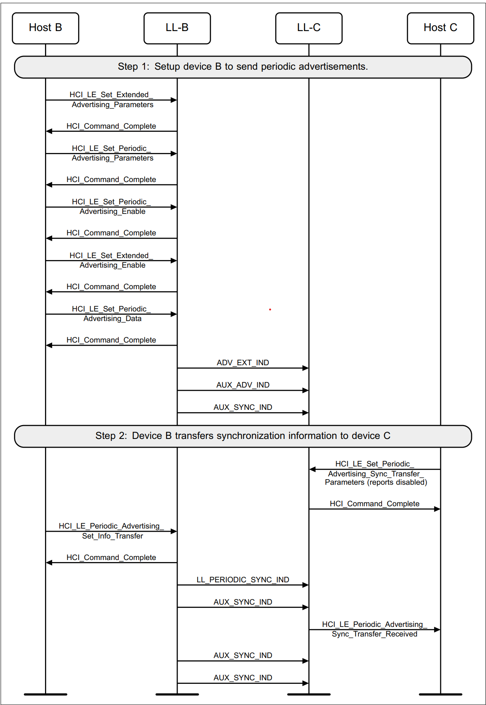
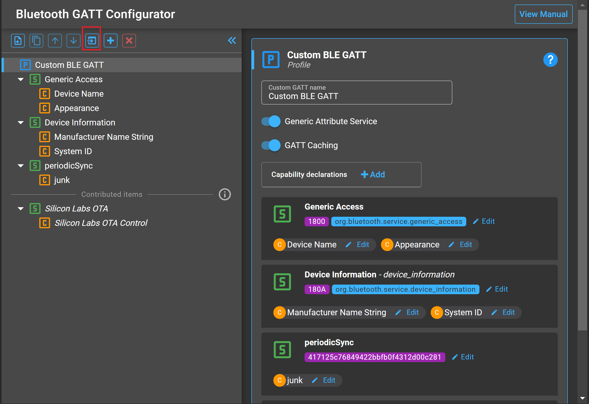
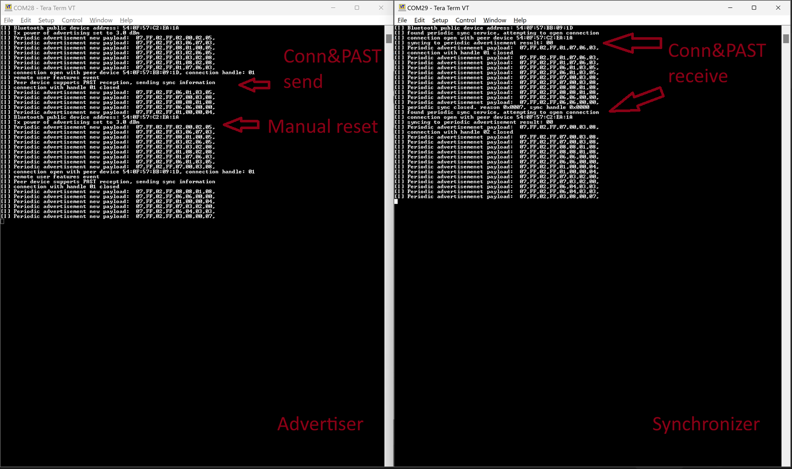
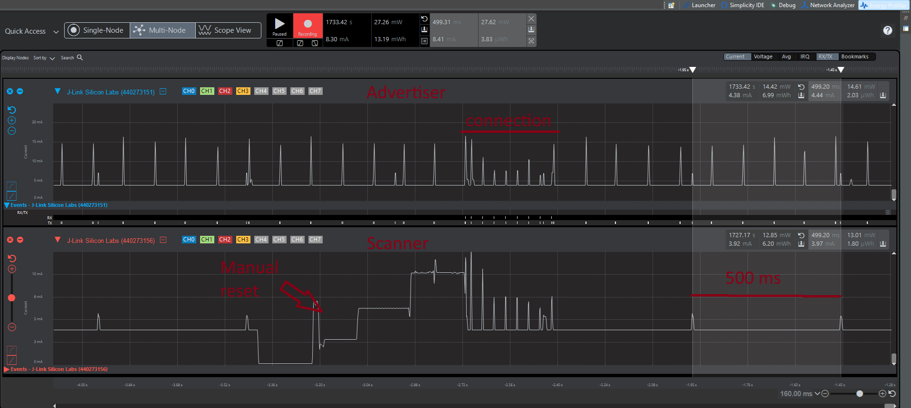

# Periodic Advertisement (sync transfer) Example

## Description

This example demonstrates the periodic advertising feature of Bluetooth 5, detailed in the [Periodic Advertising](https://docs.silabs.com/bluetooth/latest/bluetooth-fundamentals-advertising-scanning/periodic-advertising) article.

This example does depend on a bluetooth connection for supplying the synchronization information through the [perodic advertising sync Transfer procedure](https://www.bluetooth.com/wp-content/uploads/Files/Specification/HTML/Core-62/out/en/host/generic-access-profile.html#UUID-32456dd3-dcdd-cf92-fd85-a29ad43f51a1)


This example consists of two projects, one for the advertiser and one for the scanner.

### Advertiser

According to Bluetooth core specification message sequence charts, an advertiser may execute the periodic advertising sync transfer procedure as follows:

<p align="center">

</p>

As shown in the chart there is a need to start an extended advertisement because:
- Periodic advertisement mandates the start of extended advertisement [even for brief period](https://www.bluetooth.com/wp-content/uploads/Files/Specification/HTML/Core-62/out/en/low-energy-controller/link-layer-specification.html#UUID-11541cae-d7a8-d7e3-d05f-85c32728443a).
- (optionally in this case) Advertise a payload that enables the identification of the device and subsequentlly a connection through which the periodic advertising sync transfer procedure (PAST) can be executed.
- *Note: the advertiser and scanenr roles used for establshing the connection and transmitting the PAST information are independent from the roles of the PAWR advertiser and synchronizer. (i.e. the PAWR advertiser can be either an advertiser or a scanner in the procedure leading up to the establishing the connection and provisionning of the sync information step)*

In this specific implementation a [periodicSync](config/gatt_configuration.btconf#L52) GATT service UUID is being used by the scanner to identify the advertiser.

The following are the APIs used to satisfy the steps mandated in the message sequence chart:

1. Pre-requisite: create an advertising set:
```C
 sl_status_t sl_bt_advertiser_create_set(uint8_t *handle);
```
2. Set the extended advertising parameters and payload:
```C
 sl_status_t sl_bt_advertiser_set_timing(uint8_t advertising_set,
                                        uint32_t interval_min,
                                        uint32_t interval_max,
                                        uint16_t duration,
                                        uint8_t maxevents);

sl_status_t sl_bt_extended_advertiser_generate_data(uint8_t advertising_set,
                                                    uint8_t discover);
```
3. Start the extended advertisement
```C
sl_status_t sl_bt_extended_advertiser_start(uint8_t advertising_set,
                                            uint8_t connect,
                                            uint32_t flags);

```

4. Set the periodic advertising parameters,payload as well as starting the periodic advertisement train:
```C
sl_status_t sl_bt_periodic_advertiser_set_data(uint8_t advertising_set,
                                               size_t data_len,
                                               const uint8_t* data);

sl_status_t sl_bt_periodic_advertiser_start(uint8_t advertising_set,
                                            uint16_t interval_min,
                                            uint16_t interval_max,
                                            uint32_t flags);
```

Once a connection is established the advertiser waits for
[sl_bt_evt_connection_remote_used_features_id](src/advertiser/app.c#185) event to occur so it can verify that the connected device supports the reception of a PAST. Then sends the synchronization information through the following API

```C
sl_status_t sl_bt_advertiser_past_transfer(uint8_t connection,
                                           uint16_t service_data,
                                           uint8_t advertising_set);
```

A [sleeptimer](src/advertiser/app.c#L159) is used to update to advertising data regularly by generating a [signal](src/advertiser/app.c#L25) that gets processed by the ble using a [special event](src/advertiser//app.c#L212)


### Scanner

According to Bluetooth core specification, a device may execute the Periodic advertising synchronization procedure through 2 methods, One of which is the periodic advertising Sync Transfer (PAST)

In this specific implementation the scanner does the following:
 1. identifies the advertiser by a [periodicSync](src/scanner/app.c#L25) service.
 2. Open a connection and wait for Sync transfer
 3. Synchronize to the PAWR and reports the advertisement payloads.


The following are the API used to execute these steps:

1. Set extended scan parameters
```C
sl_status_t sl_bt_scanner_set_parameters(uint8_t mode,
                                         uint16_t interval,
                                         uint16_t window);
```
2. Start Scanning
```C
sl_status_t sl_bt_scanner_start(uint8_t scanning_phy, uint8_t discover_mode);
```
3. Extended advertisement report [event](src/scanner/app.c#L122) and connection creation based on the identification function.  
```C
sl_status_t sl_bt_connection_open(bd_addr address,
                                  uint8_t address_type,
                                  uint8_t initiating_phy,
                                  uint8_t *connection);
```
4. PAST reception [event](src/scanner/app.c#L152)  indicating sync failure or establishement

5. Periodic advertisement report [event](src/scanner/app.c#L173)


## Simplicity SDK version ##

- SiSDK v2025.6

## Hardware Required ##

- 2 x WSTK board: BR4001A
- 2 x Bluetooth radio board, e.g: BRD4162A

## Setting up

*Note: Provided examples are fully configured and ready for use, the following is relevant if you build them from scratch*

# Advertiser

1. Create a new **SoC-Empty** project.

2. Copy the attached [src/advertiser/app.c](src/advertiser/app.c) file replacing the existing `app.c` in the project.

3. Open the .slcp file of your project, navigate to the software component tab and make sure the following components are installed:
    <ol type="a">
    <li>Log</li>
    <li>IO Stream: USART component with the default instance name: vcom</li>
    <li>Extended Advertising</li>
    <li>Periodic Advertising</li>
    <li>Transfer periodic synchronization information for a local advertising set </li>
    </ol>
4. Further software component configuration (image for illustation)
    <ol type="a">
    <li>Board Control:Enable Virtual COM UART</li>
    <li>Advertising Base Feature: Max number of advertising sets reserved for user (for multiple periodic advertisement or extra extended/legacy advertisement)</li>
    <li>Periodic Advertising: Max number of advertising sets that support periodic advertising</li>
    </ol>
      

5. Import the GATT configuration:
    - Open the **Bluetooth GATT Configurator** under the **CONFIGURATION TOOLS** tab.
    - Find the Import button and import the attached **gatt_configuration.btconf** file.

    

6. **Save and close** then the tool will auto-generate to code.

7. Build and flash the project to the **Advertiser** device.


# Scanner

1. Create a new **SoC-Empty** project.

2. Copy the attached [src/scanner/app.c](src/scanner/app.c) file replacing the existing `app.c` in the project.

3. Open the .slcp file of your project, navigate to the software component tab and make sure the following components are installed:
    <ol type="a">
    <li>Log</li>
    <li>IO Stream: USART component with the default instance name: vcom</li>
    <li>Scanner for extended advertisements</li>
    <li>Synchronization to Periodic advertising trains by receiving PAST</li>
    </ol>
4. Further software component configuration (image for illustation)
    <ol type="a">
    <li>Board Control:Enable Virtual COM UART</li>
    <li>Periodic Advertising Synchronization: Max number of periodic advertising synchronizations (for syncing to multiple trains)</li>
    <li>Periodic Advertising: Max number of advertising sets that support periodic advertising</li>
    </ol>
      


6. **Save and close** then the tool will auto-generate to code.

7. Build and flash the project to the **Scanner** device.


## Usage

After flashing the applications to the devices, launch console for both **Advertiser** and **Scanner**, and reset both devices. On the logs, you should be able to observe that those devices are sending and receiving periodic advertisements after the connection and PAST operation had been executed successfully.
Here we issue a manual reset on the advertiser side, consequencially the synchronizer timeout (reason 0x0007) and then proceeds to scan again and launch the connection and PAST procedure.



The advertiser changes the content of the advertisement at regular intervals when the timer callback fires up, but in reality if the periodic advertisement interval is smaller than the timer timeout value then the advertiser controller will continue using the same data which is refleacted by the multiple reports on the scanner side with the identical payload.

Use the energy profiler in Simplicity studio to evaluate the current consumption. Here you can observe:
- The extended advertisement current peak every 100ms on the advertiser.
- The periodic advertisement/synchronized scanning current peak every 500ms both on the advertiser and the scanner.
- After a  manual reset on the scanner, a connection is established and the PAST is performed.
- Note: the normal scanning interval set to 125ms is not shown on this image.


